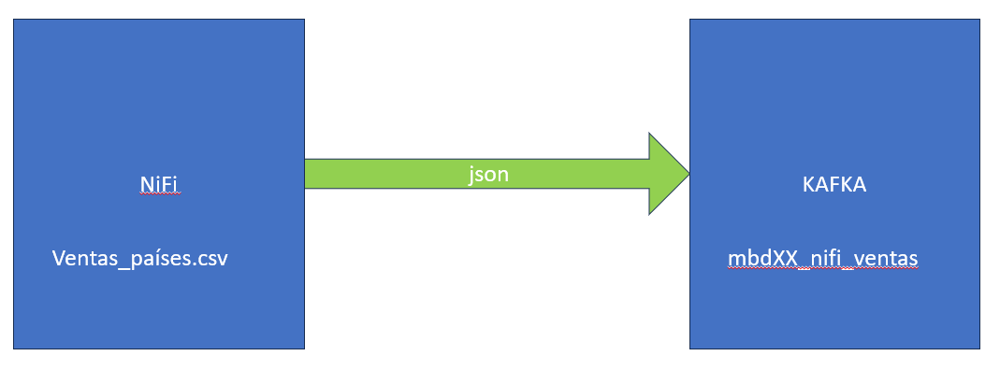
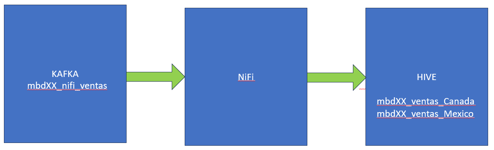

# Caso práctico NiFi II

Este caso practico vamos a conectar algunas de las aplicaciones que hemos descubierto en esta asignatura.
De esta forma podemos identificar el uso que se hace de cada una de ellas en el entorno empresarial.

## Caso 1 - Enviar datos desde NiFi a Kafka

Vamos a utilizar el dataset del caso practico anterior para enviar los datos a kafka en formato json.
Crearemos un topic en el cluster kafka de la siguiente forma mbdXX_nifi_ventas

   
   
   _Ingesta de datos desde NiFi a Kafka_
   
**Pasos recomendados**

1- Crear topic en kafka de nombre mbdXX_nifi_ventas

2- Montar el flujo en NiFi para publicar mensajes en kafka

3- Leer datos del topic de kafka para comprobar que se está escribiendo con json
   

## Caso 2 - Kafka -> NiFi -> Hive

Vamos a leer el topic del caso anterior desde Nifi para generar una tabla para las ventas de canada y otra para las de mexico

_Lectura de datos de kafka desde NiFi e ingesta en hive_

**Pasos recomendados**

1- Leer datos del topic creado en kafka

2- filtrar datos de Canada, Mexico y separar ambos flujos

3- Enviar datos a HDFS

4- Crear tablas

<!-- ## Caso 3 - Kafka -> NiFi -> Solr -->

<!-- En este caso, vamos a volver a leer los datos del topic creado en kafka y los vamos a enviar a Solr -->

