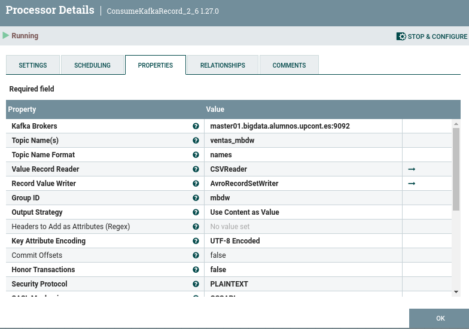
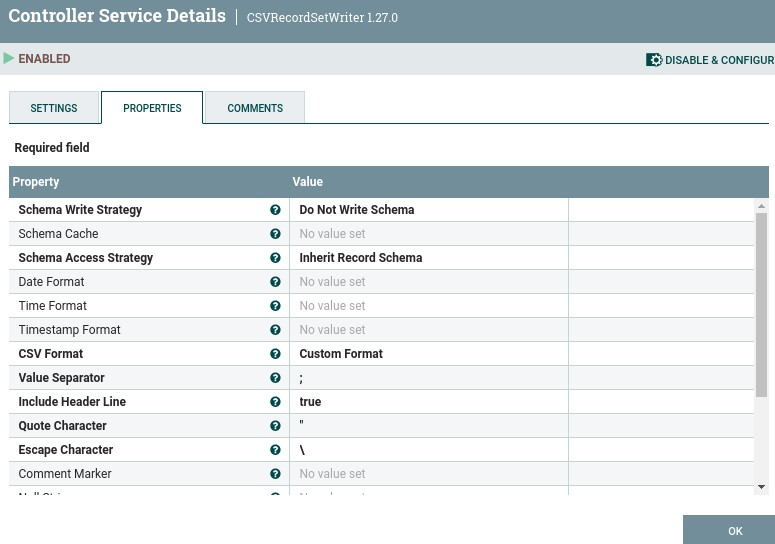

# Caso práctico NiFi - Hive

Este caso practico vamos a crear una tabla en Hive con los datos de un topic de kafka

## Caso 1 - Enviar datos desde Kafka a NiFi

A continuación detallamos los pasos a realizar:

1. Seleccionamos un procesador (primer icono grande) y lo arrastramos en nuestra área de trabajo.
2. Así pues, buscamos el procesador ConsumerKafkaRecord_2_6 y lo añadimos al flujo.
3. Configuramos las propiedades del procesador de la siguiente forma:
	
	
	
   
   _Propiedades Consumer Kafka_

4. Configuramos también el CSVReader

	
   
   _Propiedades CSVReader_

5. Y el CSVWriter

	
    
	
   _Propiedades CSVWriter_
   
6. Activamos los Reader/Writer

    
	
   _Activar CSVWriter_
   
7. Por último marcamos la relacion parse.failure como terminada

	
	
   _Activar CSVWriter_

   
## Caso 2 - Split y Avro

Vamos a leer hacer split de los mensajes anteriores y vamos a convertir los mensajes en avro para enviarlos a HDFS

1. Seleccionamos el procesador SplitRecord y lo arrastramos en nuestra área de trabajo.

2. Configuramos las propiedades del procesador de la siguiente forma:
	
	

	_Propiedades SplitRecord_
	
3. Configuramos el AvroRecordSetWriter

	

	_Propiedades Writer Avro_

4. Terminamos las relaciones que no son spliteadas

	

	_Terminar relaciones_
	
5. Unimos los dos procesadores con la relacion succes
