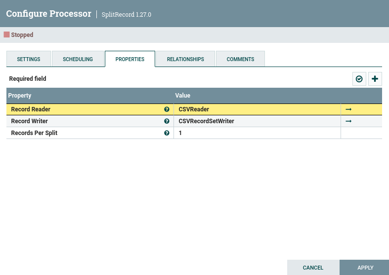

# Caso práctico NiFi - Hive

Este caso practico vamos a crear una tabla en Hive con los datos de un topic de kafka

## Caso 1 - Enviar datos del dataset de ventas a kafka

En primer lugar vamos a crear un topic donde poder enviar los datos del fichero csv que vimos en el caso práctico.
En mi caso se va a llamar ventas_mbdw

Desde el nodo edge ejecutamos:
```
kafka-topics --bootstrap-server  master01.bigdata.alumnos.upcont.es:9092 --topic ventas_mbdw --create --partitions 1 --replication-factor 1
```

Ahora continuamos desde la aplicacion nifi.

1. Añadimos un procesador a nuestro canvas de tipo GetFile y añadimos la ruta desde donde queremos que lea el fichero. Recordar que si no queremos que el procesador lea recurrentemente el mismo archivo tenemos que poner la opcion _Keep Source File_ a false

	

2. Ahora añadimos un procesador de tipo SplitRecord para generar un Flow File por cada fila del fichero csv

	

3. Añadimos un procesador para publicar en kafka con las siguientes propiedades:

   	

4. Por ultimo unimos los procesadores GetFile y SplitRecords para los casos de exito y los procesadores SplitRecord y PublishKafka para los casos splits. Y autoterminamos el resto de relaciones para cada uno de los procesadores.

	

6. Finalmente copiamos el fichero csv en la ruta indicada en el punto 1 y podremos comprobar que los eventos están llegando al topic kafka con el siguiente comando lanzado desde el edge:
```
kafka-console-consumer --bootstrap-server  master01.bigdata.alumnos.upcont.es:9092 --topic  ventas_mbdw  --from-beginning
```

## Caso 2 - Enviar datos desde Kafka a NiFi

A continuación detallamos los pasos a realizar:

1. Añadimos el procesador ConsumerKafkaRecord_2_6 al flujo de trabajo.
2. Configuramos las propiedades del procesador de la siguiente forma:
	
	
	
   
   _Propiedades Consumer Kafka_

3. Configuramos también el CSVReader

	
   
   _Propiedades CSVReader_

4. Y el CSVWriter

	
    
	
   _Propiedades CSVWriter_
   
5. Activamos los Reader/Writer

    
	
   _Activar CSVWriter_
   
6. Por último marcamos la relacion parse.failure como terminada

	
	
   _Activar CSVWriter_

   
## Caso 2 - Split y Avro

Vamos a leer hacer split de los mensajes anteriores y vamos a convertir los mensajes en avro para enviarlos a HDFS

1. Seleccionamos el procesador SplitRecord y lo arrastramos en nuestra área de trabajo.

2. Configuramos las propiedades del procesador de la siguiente forma:
	
	

	_Propiedades SplitRecord_
	
3. Configuramos el AvroRecordSetWriter

	

	_Propiedades Writer Avro_

4. Terminamos las relaciones que no son spliteadas

	

	_Terminar relaciones_
	
5. Unimos los dos procesadores con la relacion success
