# Caso práctico NiFi

Este caso practico va a ayudarnos a familiarizarnos con el framework de nifi.
Se divide en cuatro casos sencillos donde veremos algunas de las funcionalidades que nos ofrece esta aplicacion

## Caso 1 - Mover datos

Vamos a hacer un pequeño ejercicio con Nifi para familiarizarnos con el entorno desarrollando un flujo de datos sencillo que mueva un fichero de un directorio a otro.

A continuación detallamos los pasos a realizar:

1. Seleccionamos un procesador (primer icono grande) y lo arrastramos en nuestra área de trabajo.
2. Nos aparece un dialogo con tres partes diferenciadas:

   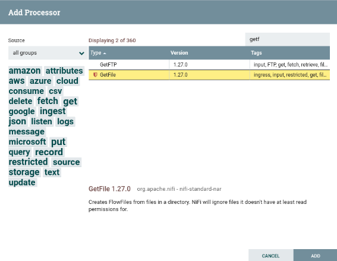
   
   _Diálogo de elección de procesador_
   

   1. A la izquierda una nube de etiquetas para poder filtrar los procesador.
   1. Arriba a la derecha tenemos un buscador para buscar procesadores por su nombre
   1. La parte central con el listado de procesadores, desde donde lo podemos seleccionar.

Así pues, buscamos el procesador *GetFile* y lo añadimos al flujo.

3. Damos doble click sobre el elemento gráfico que representa nuestro procesador, y en la pestaña *properties* indicamos el directorio de entrada de donde tendrá que recoger el fichero mediante la propiedad *Input Directory*. En nuestro caso le pondremos el valor /home/iabd/Documentos/in:

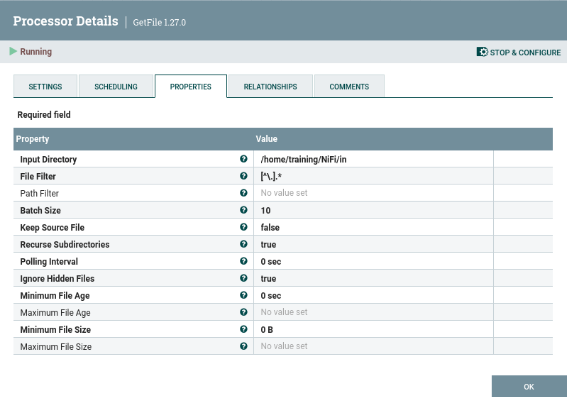

_Propiedades de GetFile_

4. Ahora añadimos un nuevo procesador de tipo *PutFile*, y en las propiedades indicamos el directorio de salida con la propiedad *directory* a /home/iabd/Documentos/out.
5. Si visualizamos la pestaña *Settings*, y nos centramos en el lado derecho, podemos configurar el comportamiento a seguir si el procesador se ejecuta correctamente (*success*) o falla (*failure*). Como vamos a hacer que este procesador sea el paso final, vamos a configurar que *autoterminen* marcando ambos casos:

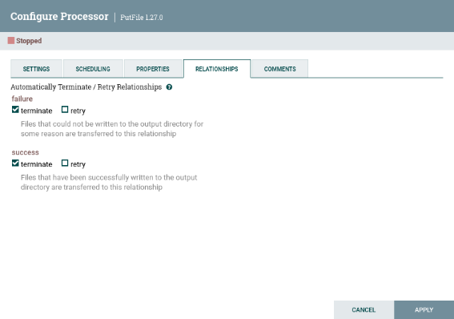

_Finalización de PutFile_

***Terminar las relaciones***

Si nos olvidamos de autoterminar las relaciones, o tenemos conexiones sin conectar, no podremos iniciar los procesadores implicados. Esto lo tenemos que realizar para todos los procesadores que tengamos en nuestro flujo de datos.

6. Unimos ambos procesadores creando una conexión. Para ello, tras pulsar sobre el icono de la flecha que aparece al dejar el ratón sobre el primer procesador y lo arrastramos hasta el segundo.

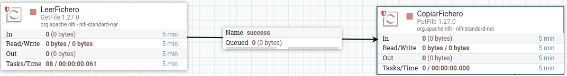

_Conexión mediante un conector entre procesadores_

7. Antes de arrancar el primer procesador, creamos un pequeño fichero en el directorio que hemos puesto como entrada:
```
echo "Hola Mundo!" > hola.txt
```
8. Arrancamos el procesador mediante el botón derecho y la opción *Start*, y comprobamos que el fichero ya no está en la carpeta in, y que sí aparece en la cola (*Queued 1*). También podemos comprobar como tampoco está en la carpeta out.
9. Finalmente, arrancamos el procesador de *Poner Fichero*, y veremos como la cola se vacía y el archivo aparece en la carpeta out.

¡Ya hemos creado nuestro primer flujo de datos!

***Gestion de los errores***

¿Qué sucede si leemos dos veces un archivo con el mismo nombre? Tal como lo hemos definido en nuestro flujo, sólo se guardará la primera copia.

Si vamos a la pestaña *Properties* del procesador *PonerFichero*, podemos cambiar este comportamiento en la propiedad *Conflict Resolution Strategy* a *replace*, de esta manera, se guardará el último archivo.

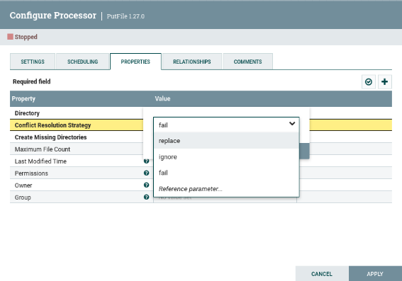

_Propiedades de PutFile - gestión de conflictos_

Realmente, en vez de decidir si lo ignora o lo sobreescribe, lo ideal es definir un nuevo flujo que dependa del estado de finalización del procesador. De esta manera, podremos almacenar todos los archivos que han llegado con el mismo nombre para su posterior estudio.

Así pues, vamos a quitar la *autoterminación* que antes habíamos puesto al procesador de *PonerFichero*, para que cuando falle, redirija el flujo a un nuevo procesador *PutFile* que coloque el archivo en una nueva carpeta (en nuestro caso en /home/iabd/Documentos/conflictos):

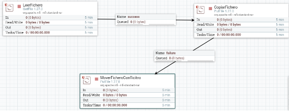

_Flujo failure para los ficheros repetidos_

Aunque ahora tenemos un mecanismo para almacenar los ficheros que coinciden en nombre, sólo nos guardará uno (nos sucede lo mismo que antes, pero ahora sólo con los repetidos).

Asi pues, necesitamos renombrar los ficheros que vayamos a colocar en la carpeta conflictos para guardar el histórico. Para ello, necesitamos introducir un procesador previo que le cambie el nombre al archivo.

Nifi añade la propiedad filename a todos los FF. Esta propiedad la podemos consultar mediante el [*Nifi Expression Language* (Nifi EL)](https://nifi.apache.org/docs/nifi-docs/html/expression-language-guide.html) y haciendo uso del procesador *UpdateAttribute* modificar su valor.

Así pues, vamos a colocar el procesador *UpdateAttribute* antes de colocar los archivos en la carpeta de conflictos:

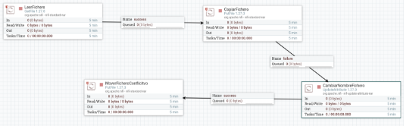

_Añadimos el procesador UpdateAttribute_

Hemos decidido añadir como prefijo al nombre del archivo la fecha del sistema en formato de milisegundos, de manera que obtendremos archivos similares a _ _1637151536113-fichero.txt_ _. Para ello, añadimos un nuevo atributo que llamaremos filename haciendo clic sobre el icono de + que aparece arriba a la derecha y en su valor utilizaremos la expresión ${now():toNumber()}-${filename}:

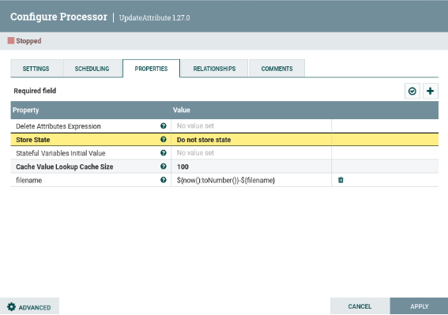

_Añadimos el procesador UpdateAttribute_


## Caso 2 - Trabajando con atributos

Cada vez que se generan FlowFile (representa un registro de datos que viaja por el flujo) estos van a tener asignados ciertos atributos por defecto. Entre estos atributos están el UUID o identificador único, su *timestamp* y el tamaño del fichero. Como ya hemos visto, mediante el uso de procesadores podremos modificar estos o añadir nuevos atributos.

Generando contenido

Vamos a ver cómo hacerlo realizando los siguientes pasos:

1. Vamos a añadir un procesador del tipo GenerateFlowFile (este procesador crea FF con datos aleatorios o contenidos personalizados, lo cual es muy útil para testear y depurar nuestros flujos de datos).

   En las opciones del procesador vamos a la pestaña de propiedades y completamos los campos:

   1. Flow Size: 10 bytes
   1. Batch Size: 1 para que nos genere un FF por cada ejecución
   1. Data Format: Text
   1. Unique Flowfiles: true e indicamos que los FF van a ser únicos.

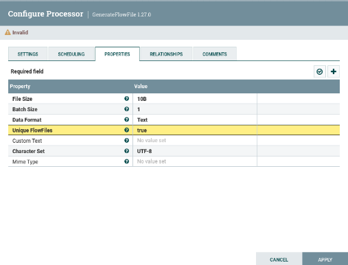

_Configuración del procesador GenerateFlowFile_

A continuación, en la configuración de planificación (*Scheduling*) de este procesador vamos a indicar que se ejecute cada 3 segundos (en el campo *Run Schedule* le ponemos como valor 3 sec).

1. Una vez tenemos listo el generador, vamos a añadir el procesador *ReplaceText* con el que cambiaremos el texto. Tras ello, conectamos ambos procesadores.

   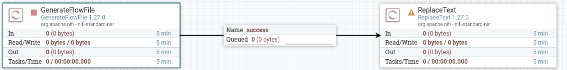

   _Conexión con ReplaceText_
   
1. Si nos fijamos, a la izquierda del nombre del procesador, aparece un icono de aviso, el cual nos indica que necesitamos configurar el nuevo procesador, además de indicarnos que ambas relaciones no están conectadas o que faltan por autocompletar.

   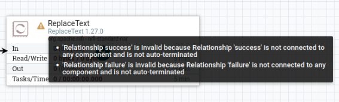

   _Avisos que aparecen_

   Para ello, configuramos la estrategia de reemplazo para que lo haga siempre (en el campo *Replacement Value* seleccionamos *Always Replace*), y al hacer esto el campo Search Value se invalida. Además, en el *Replacement Value* vamos a indicar simplemente prueba. Finalmente, marcamos para que autotermine la conexión failure.

1. Añadimos un procesador de tipo *LogAttribute* para mostrar en el log los atributos del FF, y conectamos el procesador anterior (*ReplaceText*) a éste mediante la relación success.

   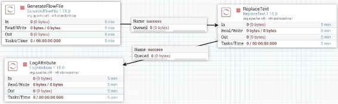

   _Log con los atributos_

1. Arrancamos el primer procesador y visualizamos la cola para comprobar qué ha generado. Para ello, sobre la cola elegimos la opción *list queue* para ver su contenido, y tras elegir uno, sobre el icono del ojo, visualizamos su contenido y comprobado que ha generado datos aleatorios:

   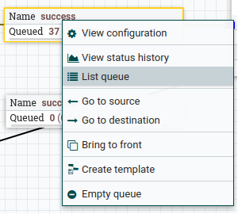

   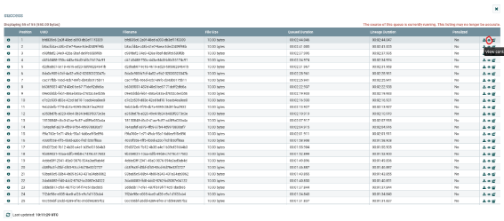

   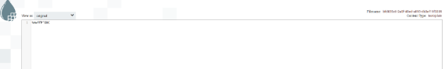

   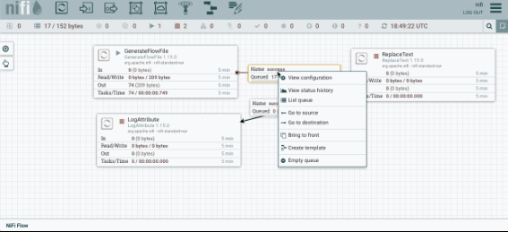

   _Acceso y visualización de la cola_

1. Si ejecutamos el siguiente procesador, vemos que saca el FF de la cola anterior y aparecerá en la siguiente. Si comprobamos su valor, veremos que ha cambiado el valor original por prueba.

   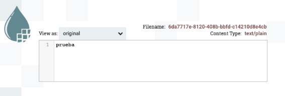

   _Resultado de visualizar la cola tras ReplaceText_

Si accedemos al log de la aplicación (archivo nifi-app.log dentro de la carpeta logs) veremos mensajes similares a:

2024-10-26 10:17:17,455 INFO [Timer-Driven Process Thread-10] o.a.n.processors.standard.LogAttribute LogAttribute[id=c84bc39d-0192-1000-9358-a528a7a52b6a] logging for flow file StandardFlowFileRecord[uuid=0bd57853-944f-4c2f-b563-974c00950be3,claim=StandardContentClaim [resourceClaim=StandardResourceClaim[id=1729936702247-1, container=default, section=1], offset=2859, length=6],offset=0,name=0bd57853-944f-4c2f-b563-974c00950be3,size=6]

\--------------------------------------------------

FlowFile Properties

Key: 'entryDate'

`	`Value: 'Sat Oct 26 10:17:17 UTC 2024'

Key: 'lineageStartDate'

`	`Value: 'Sat Oct 26 10:17:17 UTC 2024'

Key: 'fileSize'

`	`Value: '6'

FlowFile Attribute Map Content

Key: 'filename'

`	`Value: '0bd57853-944f-4c2f-b563-974c00950be3'

Key: 'path'

`	`Value: './'

Key: 'uuid'

`	`Value: '0bd57853-944f-4c2f-b563-974c00950be3'

\--------------------------------------------------

Añadiendo un atributo

Ahora vamos a extraer el contenido del FF a un atributo mediante el procesador *ExtractText*.

7. En las propiedades, creamos una nueva propiedad (botón + de la esquina superior derecha) que llamaremos contenido, y en cuyo valor vamos a poner la expresión .\* que indica que queremos que coincida con todo.

   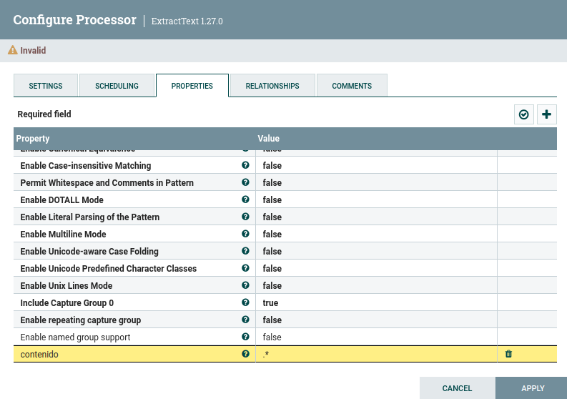

   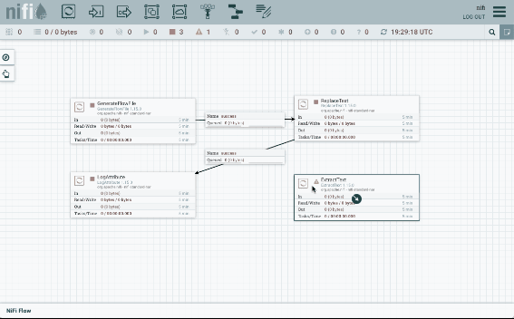

   _Añadimos la propiedad contenido a ExtractText_

7. Una vez creado, vamos a colocar este procesador entre los dos anteriores (para el segundo con el caso matched, que es cuando ha coincidido con la expresión regular). En la conexión unmatched la marcamos para que autotermine, y comprobamos que no tenemos ningún advertencia en ningún procesador.

   

   _Flujo completo del caso 2_

7. Finalmente, ejecutamos todos los procesadores y comprobamos como en el log aparece el nuevo atributo creado. También podemos acceder a la cola, y en la parte izquierda de cada flujo, en el icono de la i, pulsar y comprobar la pestaña *Atributes*.

   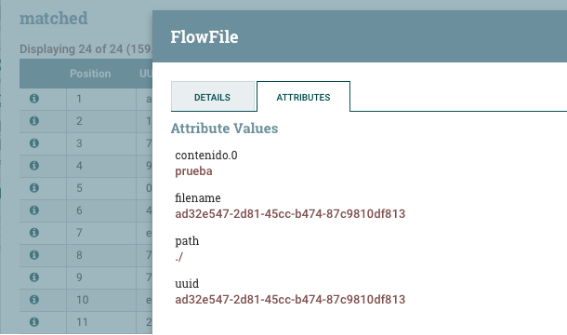Comprobación de los atributos de un FF

_Linaje de los datos_

Para comprobar el dato final, es muy útil utilizar la opción de *Data provenance*, la cual nos ofrece un linaje de los datos.

**Linaje de los datos**

El linaje de los datos describe el origen, movimientos, características y calidad de los datos, aportando visibilidad de punto a punto para incrementar la calidad de los datos. Se puede considerar como el historial de los datos, facilitando la documentación y gobernanza de los datos.

Para ello, sobre el procesador final, con el botón derecho, elegimos la opción *View data provenance*. Si elegimos uno de los flujos, a la derecha de cada flujo, podemos pulsar sobre el primer icono podremos ver un grafo y un *slider* que modifica el grafo respecto al instante temporal (en cada uno de los pasos, podemos hacer doble clik y ver la información y el contenido del FF en dicho momento exacto):

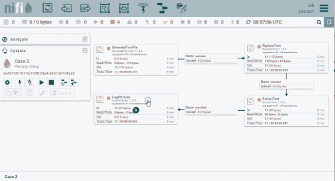Linaje de los datos


## Caso 3 - Filtrado de datos

En este caso, vamos a coger los datos de [ventas](dataset/ventas_paises.csv), el cual tiene la siguiente estructura:

**venta\_paises.csv**

ProductID;Date;Zip;Units;Revenue;Country

725;1/15/1999;41540          ;1;115.5;Germany

787;6/6/2002;41540          ;1;314.9;Germany

788;6/6/2002;41540          ;1;314.9;Germany

Utilizando Nifi, vamos a crear un nuevo fichero CSV que contenga únicamente los datos de Francia que han realizado más de una venta.

Para ello, tendremos que leer el fichero haciendo uso del procesador *GetFile*, separar cada fila en un FF mediante *SplitRecord*, filtrar los datos usando el procesador *QueryRecord* y finalmente los almacenaremos en disco gracias al procesador *PutFile*.

### Lectura y división

1. Así pues, comenzamos leyendo el fichero con el procesador *GetFile*. En este caso vamos a dejar la opción *keep source file* a *true* para que no lo elimine.
1. Mediante el procesador *SplitRecord*, vamos a separar cada fila del CSV a un FF. Para ello, primero hemos de crear un *RecordReader* y un *RecordWriter* para que sepa interactuar con el CSV (*Nifi* ya tiene varios implementados que podemos utilizar). Así pues:
   1. En el *Record Reader*, seleccionamos *Create new service*, y elegimos *CVSReader*.
   1. A su vez, en el *Record Writer* elegimos *CVSRecordSetWriter*.

Para configurar estos servicios, pulsaremos sobre la flecha, y veremos la pantalla de configuración. Para cada uno de ellos, tendremos otros tres iconos: la rueda para configurar, el rayo para activar/desactivar el servicio y la papelera para eliminarlo. Así, pues, tras comprobar los valores de *CVSReader* y *CSVSWriter* (indicamos el ; como separador de campos tanto para la lectura como la escritura de CSV en el campo *value separator y marcamos como* true *que el archivo contiene la primera fila con encabezados (*treat first line as header\*)), pulsamos sobre el rayo para activar ambos servicios.

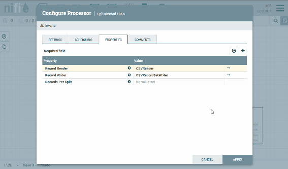

_Configuración y activación de Split Record_

Finalmente, en el campo *Records per Split* le indicamos 1 para que coloque cada fila en un FF.

### Filtrado de FF

3. En este paso, mediante el procesador *QueryRecord* vamos a ejecutar una consulta SQL contra el FF. El resultado del nuevo FF será el resultado de la consulta. En nuestro caso, como hemos comentado antes, vamos a quedarnos con las ventas de más de una unidad realizadas en Francia.

   Igual que antes, configuramos los mismos *Record Reader* y *Record Writer*. Además, hemos de poner la propiedad *Include Zero Record FlowFiles* a *false* para que no vuelva a enrutar los FF que no cumplan la consulta. Finalmente, añadimos una nueva propiedad para indicar la consulta. En nuestro caso la hemos denominado FranciaMayor1 y en el contenido ponemos la consulta:
````
   select * from Flowfile where Country = 'France' and Units > 1
````

   **campos**

   También podríamos haber filtrado los campos para recuperar menos contenido con una consulta similar a ```select ProductID, Date from FlowFile .....``` Con este procesador podemos filtrar, hacer agrupaciones, cálculos, del mismo modo que lo hacemos con SQL.

3. Finalmente, igual que hicimos en el caso 1, vamos a cambiarle el nombre a cada FF para generar un archivo por cada resultado mediante *UpdateAttribute* y persistimos los datos con *PutFile*.

El resultado del flujo de datos será similar a:

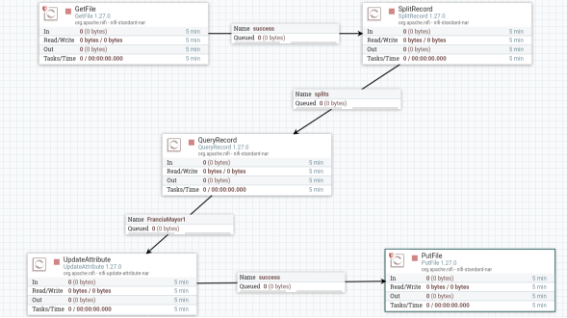

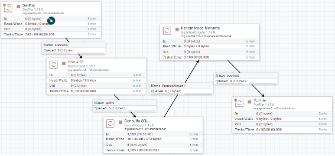

_Flujo completo del caso 3_


## Caso 4 - Fusionar datos

En esta caso vamos a realizar los siguientes pasos:

1. Escuchar datos que recibimos de un servidor web.
1. Reconocer si el mensaje contiene la cadena error.
1. Fusionar los mensajes en varios ficheros, dependiendo de si contienen un error.
1. Almacenar el fichero resultante en *MongoDB*.

### Recibir datos via HTTP

1. Vamos a utilizar el procesador *ListenHTTP* para escuchar peticiones HTTP. Para ello, lo añadimos a nuestro flujo de trabajo y configuramos:
- *Listening port* (puerto de escucha): 8081
- *Base Path* (*endpoint* de la petición): mbd
2. A continuación, para distinguir entre los diferentes datos de entrada, utilizaremos el procesador *RouteOnContent*, con el objetivo de separar en dos flujos de datos, los que contienen la cadena error y los que no. Para ello, tras añadir el procesador, le conectamos al flujo success que viene de *ListenHTTP*, y configuramos:
- Cambiamos el *Match Requirement* (requisito de coincidencia) a: content must contain match (no tienen que coincidir exactamente, sino contener el valor).
- Y añadimos la propiedad textoError con el valor ERROR.

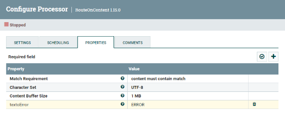

_Propiedades de RouteOnContent_

Para poder probarlo, arrancamos el primer procesador, y desde un terminal, hacemos una petición a:
```
curl --data "texto de prueba" http://localhost:8081/mbd
```
Si comprobamos la cola, podremos ver como se ha creado un FF cuyo contenido es texto de prueba.

Fusionando contenido

Si nos fijamos en las propiedades del procesador *RouteOnContent*, tenemos dos flujos de salida textoError (para los mensajes que contienen el texto ERROR) y unmatched (para los que no).

3. Vamos a añadir el procesador *MergeContent*, el cual recibe un conjunto de FF y los fusiona en uno a partir de la estrategia de fusión que defina el usuario. Las diferentes opciones incluye agrupando ciertos atributos de forma similar a como se realiza la fase *reduce* de un algoritmo *MapReduce*.

Así pues, vamos a conectar las relaciones textoError y unmatched con *MergeContent*:

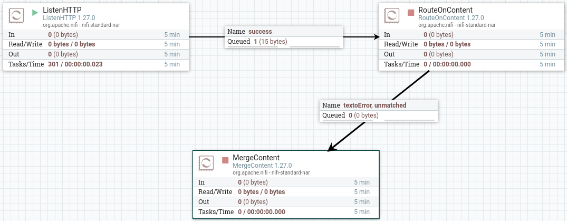

_Conexión con MergeContent_

Tras conectar los procesadores, vamos a configurar el procesador *MergeContent*:

- En la pestaña de planificación, vamos a poner que el procesador se ejecuta cada 30 segundos para poder agrupar varios FF.
- En las propiedades:
  - *Merge Strategy*: Bin-Packing Algorithm (se fusionan en grupos).
  - *Correlation Attribute Name*: RouteOnContent.Route (crea diferentes grupos para textoError y unmatched)
  - *Merge Format*: Binary Concatenation (concatena los contenidos de los FF en un único FF, otra opción sería comprimirlos en un zip)
  - *Maximum Number of Entries*: 1000 (cantidad máxima de elementos por grupo, por si tuviéramos muchas peticiones HTTP)
  - *Maximum Bin Age*: 300 sec (fuerza que el fichero fusionado salga como muy tarde a los 300s)
  - *Delimiter Strategy*: Text (para concatenar los fichero utilizando una nueva línea como carácter delimitador) y *Demarcator*: al abrir el campo, pulsar Shift/Mayús + Intro para poner el carácter del salto de línea.

Para poder probar como se van creando y agrupando los mensajes, podemos ejecutar los siguientes comandos:
```
curl --data "texto de prueba" http://localhost:8081/mbd
curl --data "este sí que tiene ERROR" http://localhost:8081/mbd
curl --data "vaya ERROR más tonto" http://localhost:8081/mbd
curl --data "nifi mola mucho" http://localhost:8081/mbd
```

Por ejemplo, si abrimos uno de los flujos podemos ver cómo se han agrupado varias peticiones en un único FF:

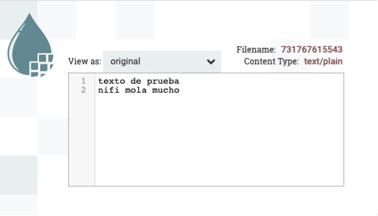

_Resultado de MergeContent_

### Guardar el resultado en una base de datos MongoDB

Para almacenar el resultado de las fusiones anteriores, vamos a guardar los resultados en una colección de MongoDB.

Suponemos que ya tenemos instalado *MongoDB* en nuestro sistema. Si no, podemos lanzarlo mediante *Docker*:

**MongoDB + Nifi via Docker**

Si queremos utilizarlo mediante Docker, necesitamos que MongoDB y Nifi estén dentro del mismo contenedor. Para ello, podemos configurarlo mediante el siguiente archivo [docker-compose.yml]:

**docker-compose.yml**

services:

`    `nifi:

`        `ports:

`            `- "8443:8443"

`        `image: apache/nifi:latest

`        `environment:

`            `SINGLE\_USER\_CREDENTIALS\_USERNAME: nifi

`            `SINGLE\_USER\_CREDENTIALS\_PASSWORD: nifinifinifi

`            `NIFI\_JVM\_HEAP\_MAX: 2g

`        `links:

`            `- mongodb

`    `mongodb:

`        `ports:

`            `- "27017:27017"

`        `image: mongo:latest

Una vez creado el archivo, construimos el contenedor mediante:

docker-compose -p nifimongodb up -d

También se puede instalar con apt:
```
sudo apt update
sudo apt install -y mongodb
sudo systemctl enable mongodb
sudo systemctl restart mongodb
sudo systemctl status mongodb
```
Para poder meter los mensajes en *MongoDB*, vamos a preparar el contenido para que esté en formato JSON. Además del contenido, vamos a crear un atributo con el nombre del enrutador utilizado para posteriormente poder filtrar los mensajes de error.

Para poder crear el formato JSON, utilizaremos el procesador *AttributesToJSON*. Así pues, previamente necesitamos pasar los mensajes desde el contenido de los FF a los atributos (para ello, igual que en el caso anterior, utilizaremos el procesador *ExtracText*). A su vez, también crearemos un nuevo atributo con el nombre del enrutador mediante el procesador *UpdateAttribute*.

El resultado final será similar al siguiente flujo:


_Resultado completo del caso 4_

5. Utilizamos el procesador *ExtracText* para pasar el contenido a los atributos. Dentro de las propiedades configuraremos:
   1. *Enable DOTALL mode*: true, para que incluya los saltos de línea como contenido.
   1. Añadimos una nueva propiedad contenido, y como expresión regular introducimos (.\*).
   1. Enable named group Support: true para que no nos incluya el numero de grupo capturado en la expresión regular

Una vez creado, conectamos *MergeContent* con *ExtractText* mediante la conexión *merged*, y el resto de conexiones las marcamos para que autoterminen.

5. Añadimos el procesador *UpdateAttribute*, y dentro de las propiedades, añadirmos una nueva propiedad que vamos a llamar estado cuyo valor será ${RouteOnContent.Route}, es decir, le ponemos el mismo que contenga el atributo *RouteOnContent.Route*.

   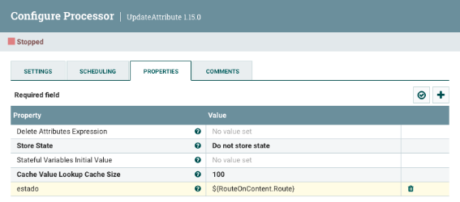

   _Creando el atributo estado_

   Una vez creado, conectamos *ExtractText* con *UpdateAttribute* mediante la conexión *matched*, y el resto de conexiones las marcamos para que autoterminen.

5. A continuación, vamos a utilizar el procesador *AttributesToJSON* para pasar los atributos contenidoy estado como contenido de un FF en formato JSON.

   Para ello, configuramos las propiedades:

   1. *Attribute List*: contenido,estado
   1. *Destination*: flowfile-content

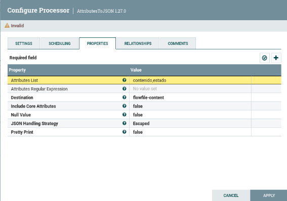

_Creando el atributo estado_

Una vez creado, conectamos *UpdateAttribute* con *AttributesToJSON* mediante la conexión *success*, y el resto de conexiones las marcamos para que autoterminen.

Si ejecutamos los procesadores anteriores y comprobamos la salida, veremos como se están creando FF cuyo contenido es la petición introducida más el estado:

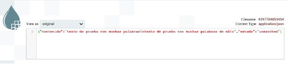

_Mensaje JSON creado_

5. Finalmente, añadimos el procesador *PutMongo* para introducir el contenido JSON. Las propiedades que hay que configurar son:
   1. Mongo URI: mongodb://localhost o mongodb://mongodb (en caso de que isntalemos con el docker-compose anterior)
   1. Mongo Database Name: mbd
   1. Mongo Collection Name: caso4

En nuestro caso, hemos autoterminado la conexión success y reconectado con el mismo procesador la conexión failure.

Si arrancamos el flujo de datos completo, y tras realizar las mismas peticiones de antes:
```
curl --data "texto de prueba" http://localhost:8081/mbd
curl --data "este sí que tiene ERROR" http://localhost:8081/mbd
curl --data "vaya ERROR más tonto" http://localhost:8081/mbd
curl --data "nifi mola mucho" http://localhost:8081/mbd
```

Sólo nos queda entrar a *MongoDB* y comprobar que nos aparecen los datos:
```
\> use mbd
switched to db mbd

\> db.caso4.find()
{ "\_id" : ObjectId("6197cca29c63ec4e825b8232"), "contenido" : "este sí que tiene ERROR\nvaya ERROR más tonto", "estado" : "textoError" }
{ "\_id" : ObjectId("6197cca29c63ec4e825b8233"), "contenido" : "texto de prueba\nnifi mola mucho", "estado" : "unmatched" }
```

Actividades

1. Realiza los casos de uso del 1 al 3. En la entrega debes adjuntar una captura de pantalla donde se vea el flujo de datos completo con una nota con tu nombre, y adjuntar la definición de cada flujo (sobre el área de trabajo, con el botón derecho, *Download flow definition*).
1. (opcional) Realiza el caso de uso 4.
